

  
  
支持手机、平板、Android TV 与 Android 车机的直播聚合客户端

HDBYvv 使用 Kotlin 与 Jetpack Compose 原生实现，支持触控、遥控器和不同窗口尺寸，将直播发现、播放、弹幕、关注、收藏与历史记录集中到一个应用中。

> 当前版本：`0.7.0` · 最低 Android 6.0（API 23）· 手机 / 平板 / Android TV / Android 车机
>
> 本项目基于既有客户端的协议与交互研究重新实现，仅用于技术研究。

## 功能

### 直播发现

- 在一个入口中浏览 5 个已接入直播平台，支持平台切换、一级分类、细分分类与分页加载。
- 自适应 16:9 直播卡片（电视保持四列，触控设备按窗口宽度与字体大小调整列数），展示直播状态、标题、主播、分区与热度。
- 支持刷新关注和观看历史中的开播状态；请求失败时保留“检查中 / 未知”状态，不误报未开播。

### 播放器

- 基于 Media3 / ExoPlayer 播放 HLS、FLV 等平台返回的直播流。
- 支持播放 / 暂停、刷新、收藏、画质切换、线路切换和直播列表选台。
- 左右键快速切换上一个 / 下一个直播间；线路故障时可自动尝试下一条可用线路。
- 可按直播间记忆清晰度，并结合设备显示与解码能力选择默认画质。

### 实时弹幕

- 已接入 4 个平台的实时弹幕协议。
- 支持视频叠加弹幕和弹幕分屏；电视保持右侧 `1/7`，触控宽屏为弹幕保留可读宽度，竖屏改为视频在上、弹幕在下。分屏模式优先展示最新消息并自动跟随。
- 可调整弹幕开关、分屏、颜色、字体 / CSS URL、字重、字号、行数、速度、不透明度与重复过滤。
- 滚动弹幕最大行数根据可用高度、字号、系统字体缩放与实际字体度量动态计算，不再固定为 6 行；设置项显示当前行数和上限。
- 全局设置页提供即时弹幕预览，无需进入直播间即可查看调整效果。

### 搜索与个人内容

- 支持站内主播名 / 房间号搜索；粘贴已接入平台的直播间链接可直接识别并播放。
- 本地收藏支持长按移除、管理模式、平台筛选与清空确认。
- 观看历史自动记录并支持开播状态刷新、继续播放和清空确认。
- 连接账号 Cookie 后，可同步已支持平台的关注列表；Cookie 默认隐藏并仅保存在本机。

### 手机推送直播

- 打开电视端「设置 → 直播推送」，用同一网络的手机扫描二维码或打开页面上的地址。
- 粘贴直播间链接或完整分享文案，点击「推送到电视」；还支持直接输入纯数字房间号。
- 观看过程中再次推送会切换当前播放器的直播间。保持应用在电视前台即可接收，退到后台会自动停止接收，也可在设置中手动关闭。
- 推送网页内置于应用，适配手机与电脑。默认端口为 `8383`，发生端口占用时以电视上显示的地址为准；Android 17 及以上首次使用需允许局域网访问。

### Android TV 体验

- 支持 Leanback 启动入口，触屏非必需；电视维持横屏布局。
- 完整的 D-pad 焦点、放大 / 描边反馈、返回层级与长列表焦点恢复。
- 浏览页以 `960 × 540dp` 为基准一屏展示 `2 × 4` 卡片；播放器浮层保留电视安全边距。
- 支持遥控器菜单键、媒体播放 / 暂停键和频道切换键。

### 手机、平板与车机

- 同一个 APK 支持 Android 手机、平板、Android TV 和可安装 Android APK 的车机；不包含 iOS / CarPlay 或 Android Auto 投射端。
- 手机支持竖屏浏览、底部六项导航、触屏搜索、长按收藏和播放器触控返回；播放器可切换横竖屏。
- 平板及宽屏窗口使用侧边导航；网格根据实际可用宽度调整，支持旋转与分屏窗口。大屏方向由系统控制。
- 设置页在窄屏使用横向分类与单栏内容，弹幕预览随内容滚动；宽屏保留侧栏与双栏预览。字体预设、弹窗操作和推送二维码可换行显示。
- 普通触控控件至少 48dp；识别到 Automotive 系统或 Android 车载模式时使用至少 64dp 的主要操作目标，保留车机系统栏。
- Android Automotive 按[驻车视频应用要求](https://developer.android.com/training/cars/parked/automotive-os)声明视频类别。系统遮挡 Activity 时在 `onPause` 暂停音视频；异步取流、切线在界面恢复前不会自动播放。普通 Android 车机的行驶限制由其系统提供。
- 手机 / 平板离开前台时暂停，返回后保留手动暂停状态；播放遵循音频焦点，耳机断开时暂停。

## 平台能力

| 平台 | 分类 / 列表 / 播放 | 实时弹幕 | 站内搜索 | 关注同步 |
|---|:---:|:---:|:---:|:---:|
| 虎牙 | ✅ | ✅ | ✅ | ✅ |
| 抖音 | ✅ | ✅ | — | — |
| 哔哩哔哩 | ✅ | ✅ | ✅ | ✅ |
| 斗鱼 | ✅ | ✅ | ✅ | — |
| YY | ✅ | — | — | — |
| 快手 / Twitch | 暂未接入 | — | — | — |

## 隐私与安全

- Cookie 仅用于对应平台请求，保存在应用本地 DataStore 中，界面默认隐藏内容。
- 应用关闭 Android 备份，不包含自更新、统计或崩溃采集模块。

## 已知限制

- 暂不包含 DLNA 投屏、IPTV / TVBOX、X5 网页直播、自更新和扫码登录。
- 直播平台可能调整接口、签名或风控策略，导致分类、取流、弹幕或关注功能临时不可用。
- Android Automotive 的系统级行驶限制和厂商特殊屏幕等限制。

## 应用截图

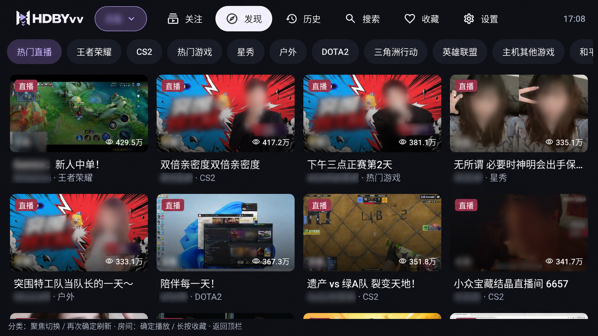
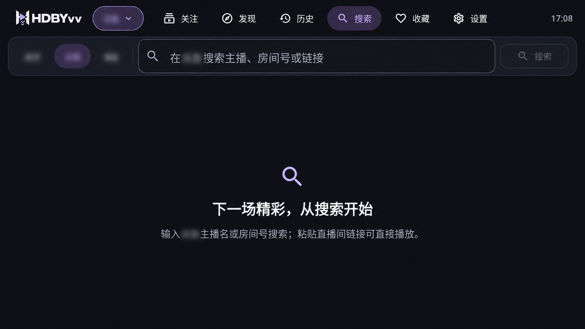
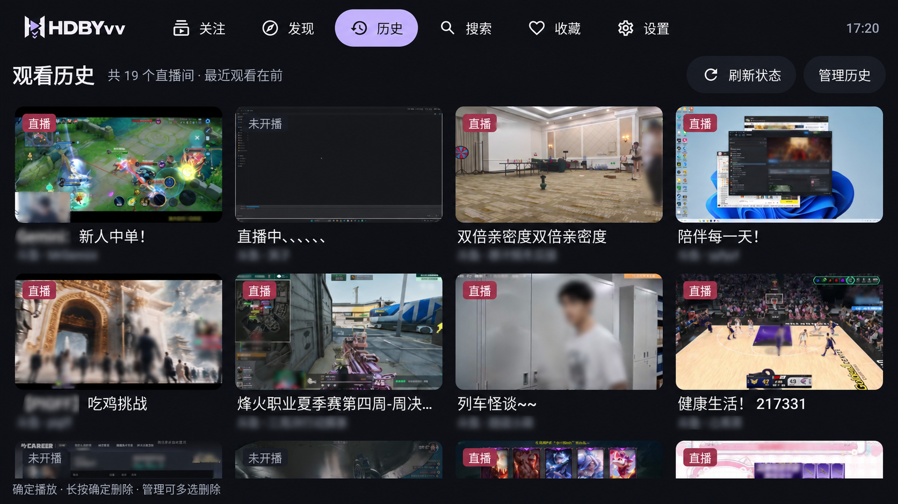
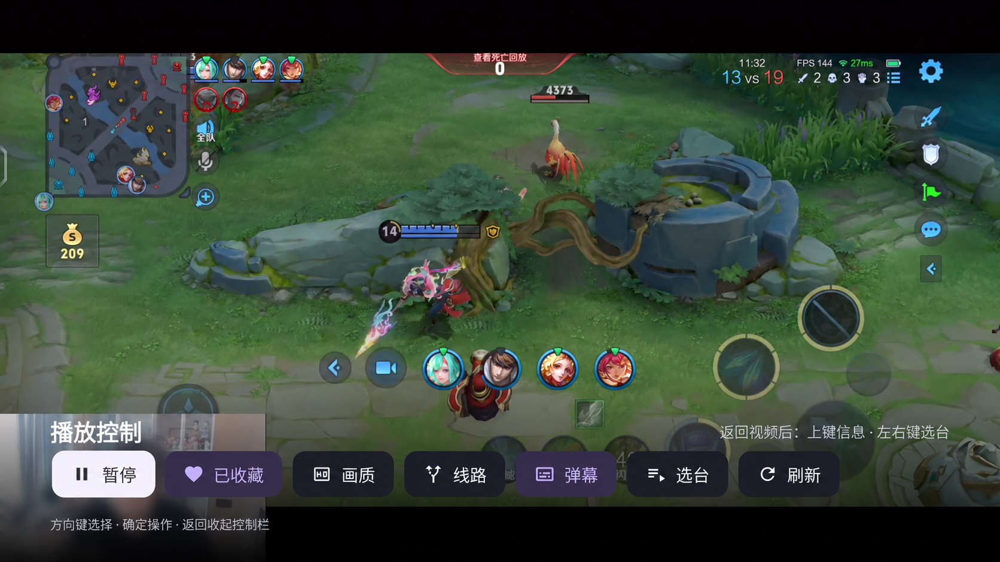
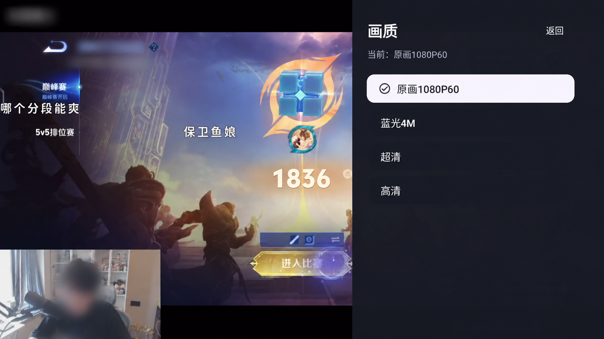
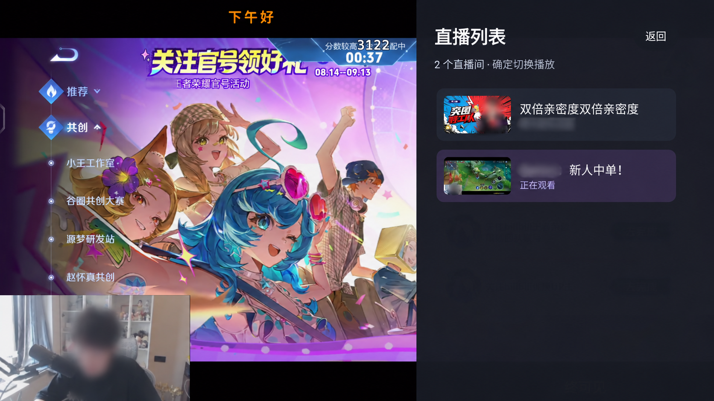
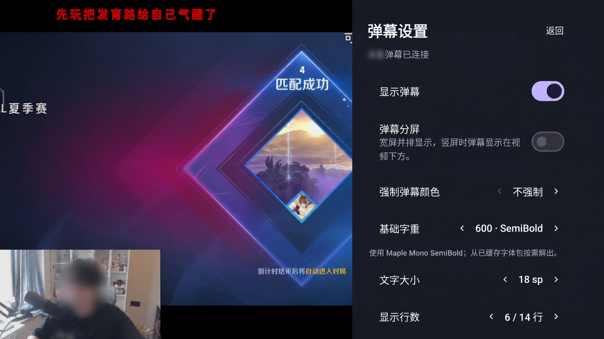
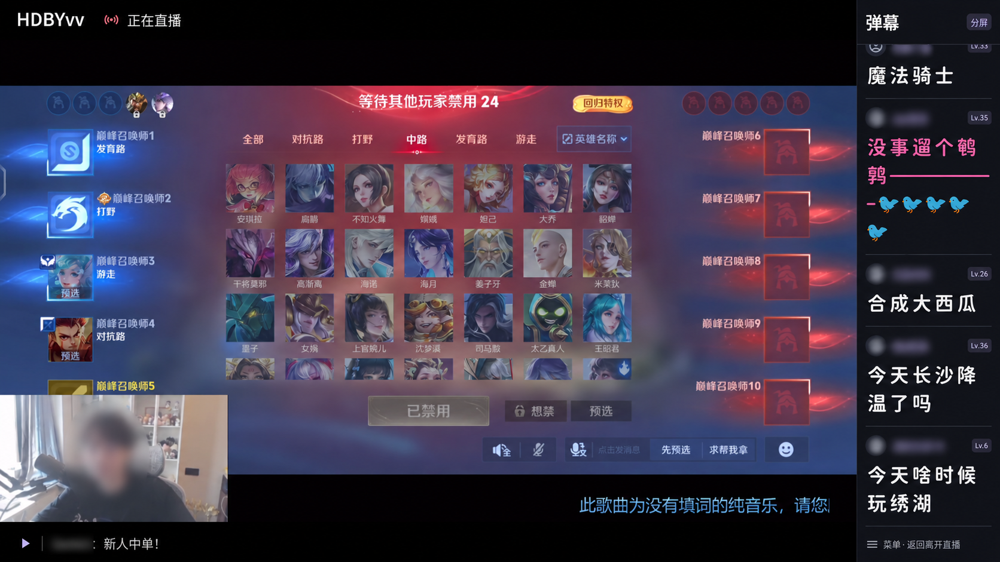
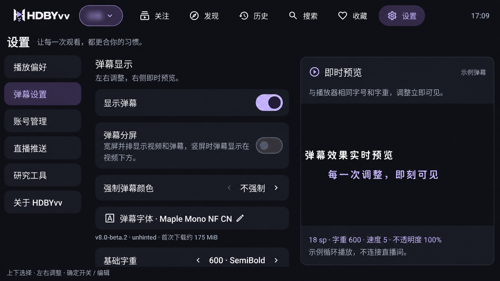
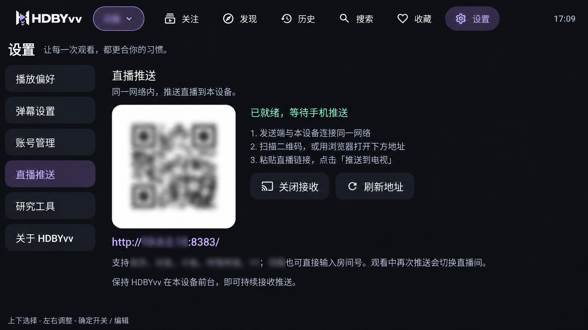
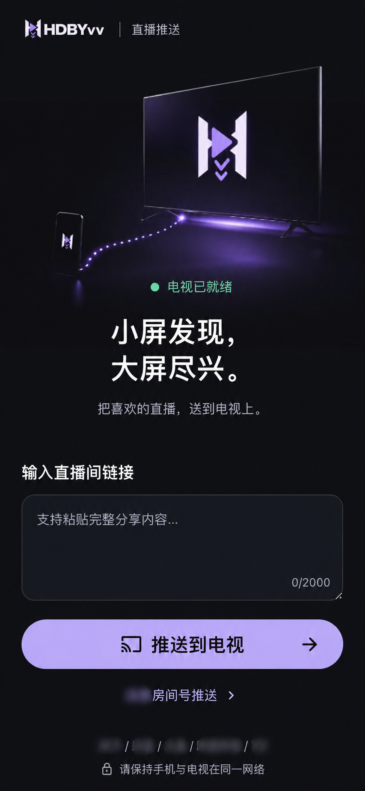

## 声明

本工程只根据协议与交互研究结果重新实现。项目仅供技术研究，请勿用于商业用途，也请遵守所在地区法律法规及各直播平台服务条款。
